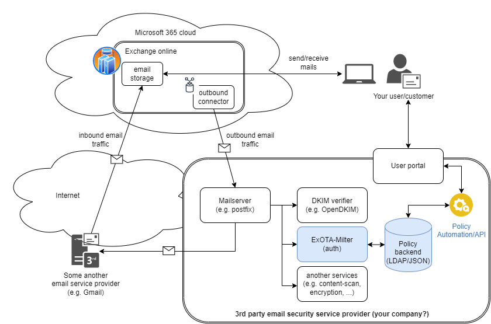

# ExOTA-Milter - Exchange Online Tenant Authorisation Milter (Mail-Filter)



*Diagram created with: https://app.diagrams.net/*

The **ExOTA-[Milter](https://en.wikipedia.org/wiki/Milter)** application is written in python3 and derives from **[sdgathman´s pymilter](https://github.com/sdgathman/pymilter)**.

# Abstract/problem/motivation
Fact is that more and more companies are migrating their Outlook/Exchange environments to the [Microsoft cloud](https://www.microsoft.com/microsoft-365).

The **ExOTA-Milter** is kind of an authentication helper which plays an essential as well as security-related role in the so called [*smarthost connector for Microsoft Exchange-Online*](https://docs.microsoft.com/de-de/exchange/mail-flow-best-practices/use-connectors-to-configure-mail-flow/set-up-connectors-to-route-mail) scenario. The milter tries to close the gap of missing [client SMTP-Auth capability](https://tools.ietf.org/html/rfc4954) of MS Exchange-Online when there´s a need to relay emails over a third party smarthost.  According to this the MS Exchange-Online platform expects the smarthost to accept emails without any further authentication of users/tenants, which can lead to many misconfigured SMTP-relays!

So, the question is: *How can an Exchange-Online user/tenant be identified by a smarthost?*

# Tenant identification options provided by Microsoft
## Client-IP ranges specified by Microsoft
Microsoft provides an ACL as [JSON file (ID: 10)](https://endpoints.office.com/endpoints/worldwide?clientrequestid=b10c5ed1-bad1-445f-b386-b919946339a7), which looks like this. 
```
[...]
{
    "id": 10,
    "serviceArea": "Exchange",
    "serviceAreaDisplayName": "Exchange Online",
    "urls": [
      "*.mail.protection.outlook.com"
    ],
    "ips": [
      "40.92.0.0/15",
      "40.107.0.0/16",
      "52.100.0.0/14",
      "104.47.0.0/17",
      "2a01:111:f400::/48",
      "2a01:111:f403::/48"
    ],
    "tcpPorts": "25",
    "expressRoute": true,
    "category": "Allow",
    "required": true
  }
[...]
```

The problem of IP based ACLs is that many other Exchange-Online customers/tenants are sending from the same IP-ranges as well! **This means that many smarthost configured to relay mails comming from Exchange-Online tend to act as open relays (for Microsoft customers) unless additional authentication mechanism on a higher layer than IP takes place! IP-address based ACLs are definitely not the right way to achieve this!**

## x509 client certificate presented by Exchange-Online
The Exchange-Online platform also *presents* a x509 client certificate to identitfy onself to the smarthost. Taking a closer look at the received header shows on that the certificates common name (CN) *mail.protection.outlook.com* is not realy tenant specific. Although the certificate provides additional security regarding the identity of the client system, it does not provide identity regarding the tenant. **IMHO that´s stil not enough to permit relaying!**
```
Received: from DEU01-FR2-obe.outbound.protection.outlook.com (mail-fr2deu01lp2173.outbound.protection.outlook.com [104.47.11.173])
	(using TLSv1.2 with cipher ECDHE-ECDSA-AES256-GCM-SHA384 (256/256 bits))
	(Client CN "mail.protection.outlook.com", Issuer "GlobalSign Organization Validation CA - SHA256 - G3" (verified OK))
	by some.secure.smarthost.example.com (Postfix) with ESMTPS id 4CjqCQ2WRCzGjg6
	for <blah.blubb@example.com>; Sat, 28 Nov 2020 12:34:26 +0100 (CET)
```
Client certificate verification is the job of the underlying MTA. So the **ExOTA-Milter** does not validate the client certificate itself, but it can be enabled (disabled per default) to match for the *expected* client CN. The mail server software [Postfix](http://postfix.org), for example, only presents the client CN to the milter API if the client certificate was successfully validated before. Otherwise the **ExOTA-Milter** will not *see* the client CN over the milter protocol ([postfix milter macro](http://www.postfix.org/MILTER_README.html#macros) `{cert_subject}`) which results in a milter reject action.

## DKIM - DomainKey Identified Message
Nevertheless, as [Microsoft supports DKIM-signing for outbound email traffic](https://docs.microsoft.com/de-de/microsoft-365/security/office-365-security/use-dkim-to-validate-outbound-email?view=o365-worldwide) the **ExOTA-Milter** can be used to authenticate sending tenants, respectively their sender domains, based on the cryptographic capabilities of [DKIM](https://tools.ietf.org/html/rfc6376). In fact the **ExOTA-Milter** does not validate the DKIM-signatures itself. Instead it simply parses DKIM-specific *Authentication-Results* headers produced by any previously DKIM-validating milter (like [OpenDKIM](http://www.opendkim.org/), [Rspamd](https://rspamd.com/) or [AMavis](https://www.ijs.si/software/amavisd/)) in the chain. I personally prefer OpenDKIM as it´s lightweight and fully focused on DKIM.

**To use DKIM for tenant/sender domain authentication, DKIM must be enabled in the milter as well as in each policy!**

**Worth to know when using OpenDKIM as AR provider:** As Microsoft already signs with 2kRSA keys be sure to use a version of OpenDKIM, which is linked against a DNS resolver library that is able to handle such large DNS responses! Further the resolver library should be aware of DNSSEC! **[libunbound](https://nlnetlabs.nl/documentation/unbound/libunbound/) meets all of these requirements :-)**. A libunbound-linked version of OpenDKIM is provided by [Debian](https://wiki.debian.org/opendkim#DNS_resolution).

*DKIM-Signature* headers appended by the Exchange-Online platform look like this:
```
[...]
DKIM-Signature: v=1; a=rsa-sha256; c=relaxed/relaxed;
 d=tenantdomain.onmicrosoft.com; s=selector1-tenantdomain-onmicrosoft-com;
 h=From:Date:Subject:Message-ID:Content-Type:MIME-Version:X-MS-Exchange-SenderADCheck;
 bh=KWHUKEKZxeQyFbKe45TV1PJMC2XrVCMTFkdwSYWR6o0=;
 b=DYTLJtLFjvVrSZtZQagTwuEe5PQYqrNGi7hR5bkhO[...snip...]
[...]
```
*Authentication-Results* headers provided by OpenDKIM (signature valid, public key not DNSSEC signed) look like this:
```
[...]
Authentication-Results: trusted.dkim.validating.relay;
  dkim=pass (2048-bit key; unprotected) header.d=tenantdomain.onmicrosoft.com header.i=@tenantdomain.onmicrosoft.com header.b=mmmjFpv8";
  dkim-atps=neutral
[...]
```

## More authentic message forwarding with DKIM alignment

From the point of view of a postmaster, message forwarding is a kind of nightmare. If DKIM alignment requirement is enabled (`ENV[MILTER_DKIM_ALIGNMENT_REQUIRED]`) the DKIM SDID (Signers Domain ID = `header.d` field of *Authentication-Results* header) must be equivalent to the RFC5322.from_domain. In this mode the **ExOTA-Milter** operates in the most secure way, but with limitations in terms of usability. With DKIM alignment enabled [traditional email forwarding](https://docs.microsoft.com/de-de/microsoft-365/admin/email/configure-email-forwarding?view=o365-worldwide) cannot be guaranteed to work. In this case the exchange online system preserves the original RFC5322.from header (e.g. *someone@gmail.com*) and signs the forwarded message with the main tenants SDID, e.g. *tenantdomain.onmicrosoft.com*. An email that was forwarded in that way cannot pass the DKIM alignment, because the RFC5322.from_domain (e.g. *gmail.com*) will never match the DKIM SDID (e.g. *tenantdomain.onmicrosoft.com*). Further there is no policy match for the RFC5322.from_domain!

Nevertheless, don´t put your head in the sand, there is a way out of this dilemma! Just use **outlook rules** instead of the classic forwarding feature to forward messages, which is described [here](https://support.microsoft.com/en-us/office/use-rules-to-automatically-forward-messages-45aa9664-4911-4f96-9663-ece42816d746). In this case the original content gets forwarded within a new message, that carries the correct RFC5322.from as well as the correct DKIM SDID! Messages forwarded in such way will always pass DKIM alignment -> mission accomplished! Don´t forget to tell your end users how to correctly set up their forwarding in outlook ;)

By the way, the global setting `ENV[MILTER_DKIM_ALIGNMENT_REQUIRED]` can be overriden per policy! Just add the following `dkim_alignment_required` key with the value `false` to the appropriate policy:
```
"yad.onmicrosoft.com": {
  "tenant_id": "1234abcd-18c5-45e8-88de-123456789abc",
  "dkim_enabled": true,
  "dkim_alignment_required": false
}
```

## X-MS-Exchange-CrossTenant-Id header (OPTIONAL!)
Further each Microsoft Exchange-Online tenant has a unique tenant-ID in form of a UUID ([RFC 4122](https://tools.ietf.org/html/rfc4122)). **ExOTA-Milter** extracts the tenant-ID from the *X-MS-Exchange-CrossTenant-Id* email header and uses it as a *mandatory* authentication factor. Since September 2022 Microsoft did not set this header  anymore reliably.
```
[...]
X-MS-Exchange-CrossTenant-Id: <UUID-of-tenant>
[...]
```
At last the **ExOTA-Milter** needs an additional policy (currently as JSON file or LDAP server), that provides a mapping of *sender-domain <-> tenant-id* and if DKIM-signatures must be taken under consideration or not. The JSON policy file itself looks like this:
```
{
  "yad.onmicrosoft.com": {
    "tenant_id": "1234abcd-18c5-45e8-88de-123456789abc",
    "dkim_enabled": true,
    "dkim_alignment_required": true
  }
}
```
# The solution
So, *how can an Exchange-Online user/tenant be identified by a third party smarthost?*

Finally it´s the combination of all of the above discussed aspects which may result in a robust-enough smarthost setup used by the Exchange-Online platform:
* restriction of client IPs via ACL (MTA)
* verification of Microsoft´s x509 client certificate (MTA)
* matching for client certificate´s CN (ExOTA-Milter)
* verification of DKIM signatures providing *Authentication-Results* header (another milter, e.g. OpenDKIM)
* consideration of DKIM verification results per sender domain (ExOTA-Milter)
* *OPTIONAL* matching for tenant-id provided in *X-MS-Exchange-CrossTenant-Id* header (ExOTA-Milter)


# How about using LDAP as policy backend?
For small setups, with not so many domains, the JSON-file policy backend (default) may be sufficient. If you´re an email service provider (ESP) maintaining a lot of customer domains in a LDAP server, you may want to use the LDAP backend instead. Details regarding the LDAP backend can be found [in the LDAP readme](LDAP/README.md).

# How about a docker/OCI image?
## Using prebuilt images from [dockerhub](https://hub.docker.com/)
* **OBSOLETE!** ~~AMD64: https://hub.docker.com/r/chillout2k/exota-milter-amd64~~
* **OBSOLETE!** ~~ARM32v6: https://hub.docker.com/r/chillout2k/exota-milter-arm32v6~~
* **NEW multi-architecture image:** https://hub.docker.com/r/chillout2k/exota-milter

The images are built on a weekly basis. The corresponding *Dockerfile* is located [here](OCI/Dockerfile)

## Build your own image
Take a look [here](OCI/README.md)

# How to test?
First of all please take a look at how to set up the testing environment, which is described [here](tests/README.md)

# How to install on docker/kubernetes/systemd?
The installation procedure is documented [here](INSTALL/README.md)

# How to *configure* the ExOTA-Milter?

|ENV variable|type|default|description|
|---|---|---|---|
|MILTER_NAME|`string`|`exota-milter`|Name of the milter instance. Base for socket path. Name appears in logs |
|MILTER_SOCKET|`string`|`/socket/<ENV[MITLER_NAME]>`|Defines the filesystem path of milter socket. The milter can be also exposed as a tcp-socket like `inet:4321@127.0.0.1`|
|MILTER_REJECT_MESSAGE|`string`|`Security policy violation!`|Milter reject (SMTP 5xx code) message presented to the calling MTA|
|MILTER_TMPFAIL_MESSAGE|`string`|`Service temporarily not available! Please try again later.`|Milter temporary fail (SMTP 4xx code) message presentetd to the calling MTA.|
|MILTER_TENANT_ID_REQUIRED|`bool`|`false`|Controls the requirement of the presence of the unofficial `X-MS-Exchange-CrossTenant-Id` header. Used as additional authentication factor.|
|MILTER_DKIM_ENABLED|`bool`|`false`|Enables/disables the checking of DKIM authentication results. Used as additional but strong authentication factor.|
|MILTER_DKIM_ALIGNMENT_REQUIRED|`bool`|`false`|Enables/disables the alighment checks of DKIM SDID with RFC-5322.from_domain. Requires ENV[MILTER_DKIM_ENABLED] = `true`|
|MILTER_TRUSTED_AUTHSERVID|`string`|`invalid`|Specifies the trusted DKIM-signature validating entity (DKIM-validator - producer of Authentication-Results header). The DKIM-validator must place exactly the same string as configured here into the Authentication-Results header! Requires ENV[MILTER_DKIM_ENABLED] = `true`|
|MILTER_POLICY_SOURCE|`string`|`file`|Policy source - Possible values `file` (JSON) or `ldap`|
|MILTER_POLICY_FILE|`string`|`/data/policy.json`|Filesystem path to the (JSON) policy file. Requires ENV[MILTER_POLICY_SOURCE] = `file`|
|MILTER_X509_ENABLED|`bool`|`false`|Enables/disables the checking of client x509-certificate. Used as additional authentication factor.|
|MILTER_X509_TRUSTED_CN|`string`|`mail.protection.outlook.com`|FQDN of authenticating client MTA. Requires ENV[MILTER_X509_ENABLED] = `true`|
|MILTER_X509_IP_WHITELIST|Whitespace or comma separated list of `string`|`127.0.0.1,::1`|List of IP-addresses for which the ExOTA-Milter skips x509 checks. Requires ENV[MILTER_X509_ENABLED] = `true`|
|MILTER_ADD_HEADER|`bool`|`false`|Controls if the ExOTA-Milter should write an additional `X-ExOTA-Authentication-Results` header with authentication information|
|MILTER_AUTHSERVID|`string`|empty|Provides ID of authenticating entity within `X-ExOTA-Authentication-Results` header to further validating instances. Required when ENV[MILTER_ADD_HEADER] = `true`|
|MILTER_LDAP_SERVER_URI|`string`|empty|LDAP-URI of LDAP server holding ExOTA policies. Required when ENV[MILTER_POLICY_SOURCE] = `ldap`|
|MILTER_LDAP_RECEIVE_TIMEOUT|`int`|5|Timespan the ExOTA-Milter waits for the LDAP server to respond to a request. This NOT the TCP-connect timeout! Requires ENV[MILTER_POLICY_SOURCE] = `ldap`|
|MILTER_LDAP_BINDDN|`string`|empty|Distinguished name of the binding (authenticating) *user*|
|MILTER_LDAP_BINDPW|`string`|empty|Password of the binding (authenticating) *user*|
|MILTER_LDAP_SEARCH_BASE|`string`|empty|Search base-DN on the LDAP server. Required when ENV[MILTER_POLICY_SOURCE] = `ldap`|
|MILTER_LDAP_QUERY|`string`|empty|LDAP query/filter used to match for a ExOTA-policy. A placeholder must be used to filter for the authenticating domain (`%d`), e.g. `(domain_attribute=%d)`|
|MILTER_LDAP_TENANT_ID_ATTR|`string`|`exotaMilterTenantId`|Custom LDAP attribute name unless using the ExOTA-milter LDAP schema|
|MILTER_LDAP_DKIM_ENABLED_ATTR|`string`|`exotaMilterDkimEnabled`|Custom LDAP attribute name unless using the ExOTA-milter LDAP schema|
|MILTER_LDAP_DKIM_ALIGNMENT_REQIRED_ATTR|`string`|`exotaMilterDkimAlignmentRequired`|Custom LDAP attribute name unless using the ExOTA-milter LDAP schema|
