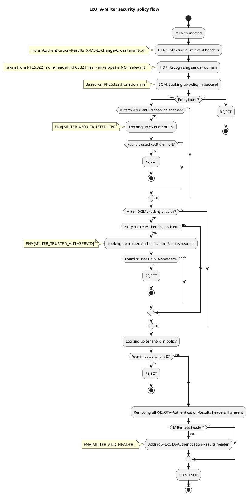

# ExOTA-Milter - Exchange Online Tenant Authorisation Milter (Mail-Filter) 

The **ExOTA-[Milter](https://en.wikipedia.org/wiki/Milter)** application is written in python3 and derives from **[sdgathman´s pymilter](https://github.com/sdgathman/pymilter)**.

# Abstract/problem/motivation
Fact is that more and more companies are migrating their Outlook/Exchange environments to the [Microsoft cloud](https://www.microsoft.com/microsoft-365).

The **ExOTA-Milter** is kind of an authentication helper which plays an essential as well as security-related role in the so called [*smarthost connector for Microsoft Exchange-Online*](https://docs.microsoft.com/de-de/exchange/mail-flow-best-practices/use-connectors-to-configure-mail-flow/set-up-connectors-to-route-mail) scenario. The milter tries to close the gap of missing [client SMTP-Auth capability](https://tools.ietf.org/html/rfc4954) of MS Exchange-Online when there´s a need to relay emails over a third party smarthost.  According to this the MS Exchange-Online platform expects the smarthost to accept emails without any further authentication of users/tenants, which can lead to many misconfigured SMTP-relays!

So, the question is: *How can an Exchange-Online user/tenant be identified by a smarthost?*

# Identification possibilities provided by Microsoft
## Client-IP ranges specified by Microsoft
Microsoft provides an ACL as [JSON file (ID: 10)](https://endpoints.office.com/endpoints/worldwide?clientrequestid=b10c5ed1-bad1-445f-b386-b919946339a7), which looks like this. 
```
[...]
{
    "id": 10,
    "serviceArea": "Exchange",
    "serviceAreaDisplayName": "Exchange Online",
    "urls": [
      "*.mail.protection.outlook.com"
    ],
    "ips": [
      "40.92.0.0/15",
      "40.107.0.0/16",
      "52.100.0.0/14",
      "104.47.0.0/17",
      "2a01:111:f400::/48",
      "2a01:111:f403::/48"
    ],
    "tcpPorts": "25",
    "expressRoute": true,
    "category": "Allow",
    "required": true
  }
[...]
```

The problem of this IP based ACL is that many other Exchange-Online customers/tenants are sending from the same IP-ranges as well! **This means that many smarthost configured to relay mails comming from Exchange-Online tends to be an open relay (for Microsoft customers) unless additional authentication mechanism on a higher layer than IP takes place! IP-address based ACLs are definitely not the right way to achieve this!**

## x509 client certificate presented by Exchange-Online
The Exchange-Online platform also *presents* a x509 client certificate to identitfy onself to the smarthost. Taking a closer look at the received header we´ll notice that the certificates common name (CN) *mail.protection.outlook.com* is not realy tenant specific. Although the certificate provides additional security regarding the identity of the client system, it does not provide identity regarding the tenant. **IMHO that´s stil not enough to permit relaying!**
```
Received: from DEU01-FR2-obe.outbound.protection.outlook.com (mail-fr2deu01lp2173.outbound.protection.outlook.com [104.47.11.173])
	(using TLSv1.2 with cipher ECDHE-ECDSA-AES256-GCM-SHA384 (256/256 bits))
	(Client CN "mail.protection.outlook.com", Issuer "GlobalSign Organization Validation CA - SHA256 - G3" (verified OK))
	by some.secure.smarthost.example.com (Postfix) with ESMTPS id 4CjqCQ2WRCzGjg6
	for <blah.blubb@example.com>; Sat, 28 Nov 2020 12:34:26 +0100 (CET)
```
Client certificate verification is the job of the underlying MTA. So the **ExOTA-Milter** does not validate the client certificate itself, but it can be enabled (disabled per default) to match for the *expected* client CN. The emailserver [Postfix](http://postfix.org), for example, only provides the client CN to the milter API if the client certificate was successfully validated. Otherwise the **ExOTA-Milter** will not *see* the client CN over the milter protocol ([postfix milter macro](http://www.postfix.org/MILTER_README.html) `{cert_subject}`) which results in a milter reject action.

## DKIM - DomainKey Identified Message
Nevertheless, as [Microsoft supports DKIM-signing for outbound email traffic](https://docs.microsoft.com/de-de/microsoft-365/security/office-365-security/use-dkim-to-validate-outbound-email?view=o365-worldwide) the **ExOTA-Milter** can be used to authenticate sending tenants, respectively their sender domains, based on the cryptographic capabilities of [DKIM](https://tools.ietf.org/html/rfc6376). In fact the **ExOTA-Milter** does not validate the DKIM-signatures itself. Instead it simply parses DKIM-specific *Authentication-Results* headers produced by any previously DKIM-validating milter (like [OpenDKIM](http://www.opendkim.org/), [Rspamd](https://rspamd.com/) or [AMavis](https://www.ijs.si/software/amavisd/)) in the chain. I personally prefer OpenDKIM as it´s lightweight and fully focused on DKIM.

*DKIM-Signature* headers appended by the Exchange-Online platform look like this:
```
[...]
DKIM-Signature: v=1; a=rsa-sha256; c=relaxed/relaxed;
 d=tenantdomain.onmicrosoft.com; s=selector1-tenantdomain-onmicrosoft-com;
 h=From:Date:Subject:Message-ID:Content-Type:MIME-Version:X-MS-Exchange-SenderADCheck;
 bh=KWHUKEKZxeQyFbKe45TV1PJMC2XrVCMTFkdwSYWR6o0=;
 b=DYTLJtLFjvVrSZtZQagTwuEe5PQYqrNGi7hR5bkhO[...snip...]
[...]
```
*Authentication-Results* headers provided by OpenDKIM (signature validated) look like this:
```
[...]
Authentication-Results: trusted.dkim.validating.relay;  dkim=pass header.d=tenantdomain.onmicrosoft.com header.s=selector1-tenantdomain-onmicrosoft-com header.b=mmmjFpv8"
[...]
```

## X-MS-Exchange-CrossTenant-Id header (policy binding)
Further each Microsoft Exchange-Online tenant has a unique tenant-ID in form of a UUID ([RFC 4122](https://tools.ietf.org/html/rfc4122)). **ExOTA-Milter** extracts the tenant-ID from the *X-MS-Exchange-CrossTenant-Id* email header and uses it as a *mandatory* authentication factor.
```
[...]
X-MS-Exchange-CrossTenant-Id: <UUID-of-tenant>
[...]
```
At last the **ExOTA-Milter** needs an additional policy (JSON file), that provides a mapping of *sender-domain <-> tenant-id* and if DKIM-signatures must be taken under consideration or not. The JSON policy file itself looks like this:
```
{
  "yad.onmicrosoft.com": {
    "tenant_id": "1234abcd-18c5-45e8-88de-123456789abc",
    "dkim_enabled": true
  }
}
```
Actually I´m also working on a LDAP-based version as policy backend.

# The solution
So, *how can an Exchange-Online user/tenant be identified by a third party smarthost?*

Finally it´s the combination of all of the above discussed aspects which may result in a robust-enough smarthost setup used by the Exchange-Online platform:
* restriction of client IPs via ACL (MTA)
* verification of Microsoft´s x509 client certificate (MTA)
* matching for client certificate´s CN (ExOTA-Milter)
* verification of DKIM signatures providing *Authentication-Results* header (another milter, e.g. OpenDKIM)
* consideration of DKIM verification results per sender domain (ExOTA-Milter)
* matching for tenant-id provided in *X-MS-Exchange-CrossTenant-Id* header (ExOTA-Milter)



# How about a docker/OCI image?
## Using prebuilt images from dockerhub.com
**WIP ;-)**

## Build your own image
Take a look [here](OCI/README.md)

# How to test?
First of all please take a look at how to set up the testing environment, which is described [here](tests/README.md)